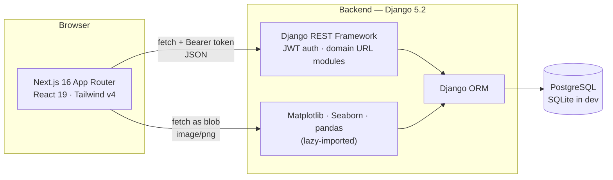
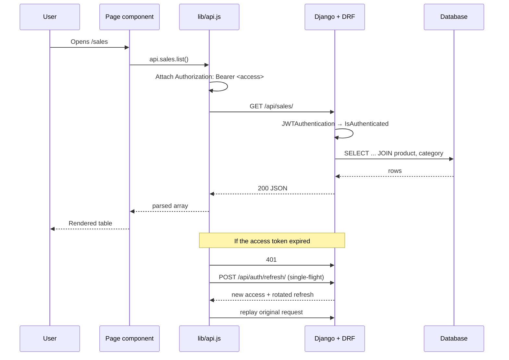
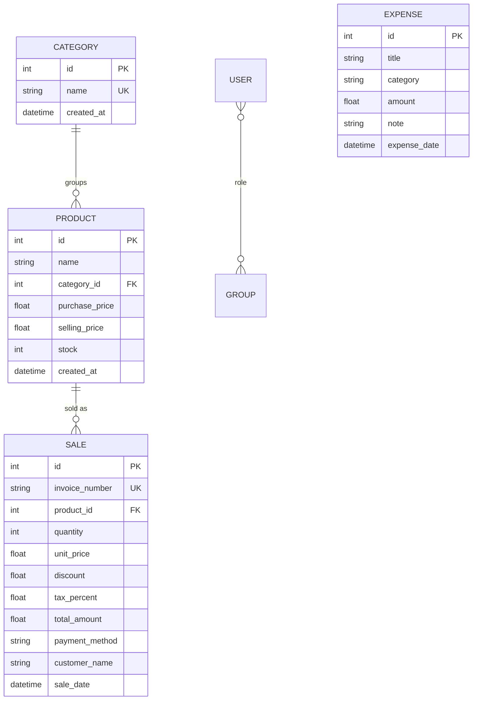
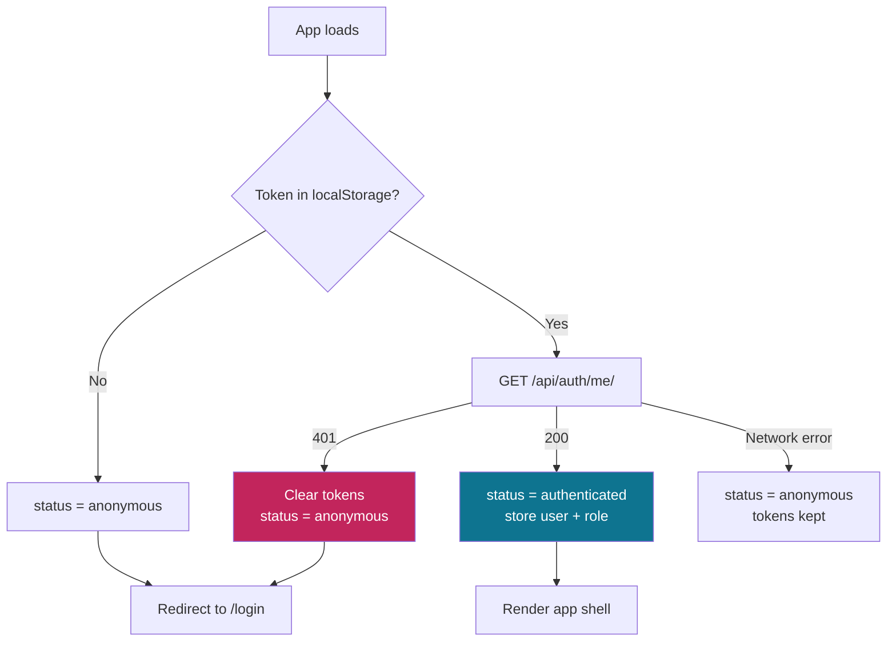
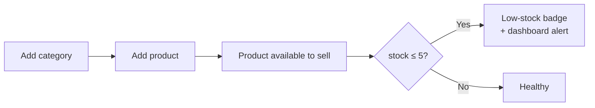
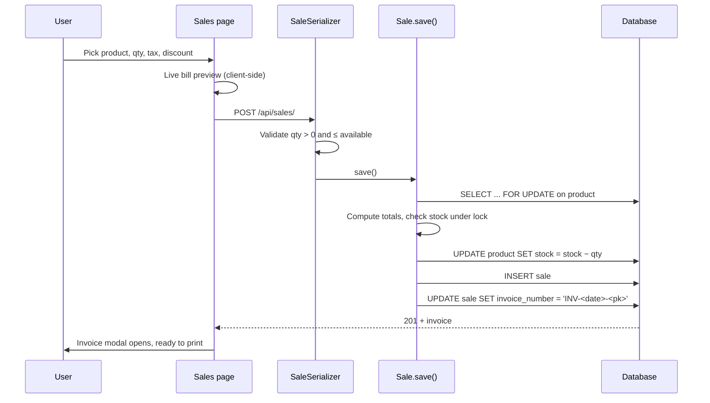
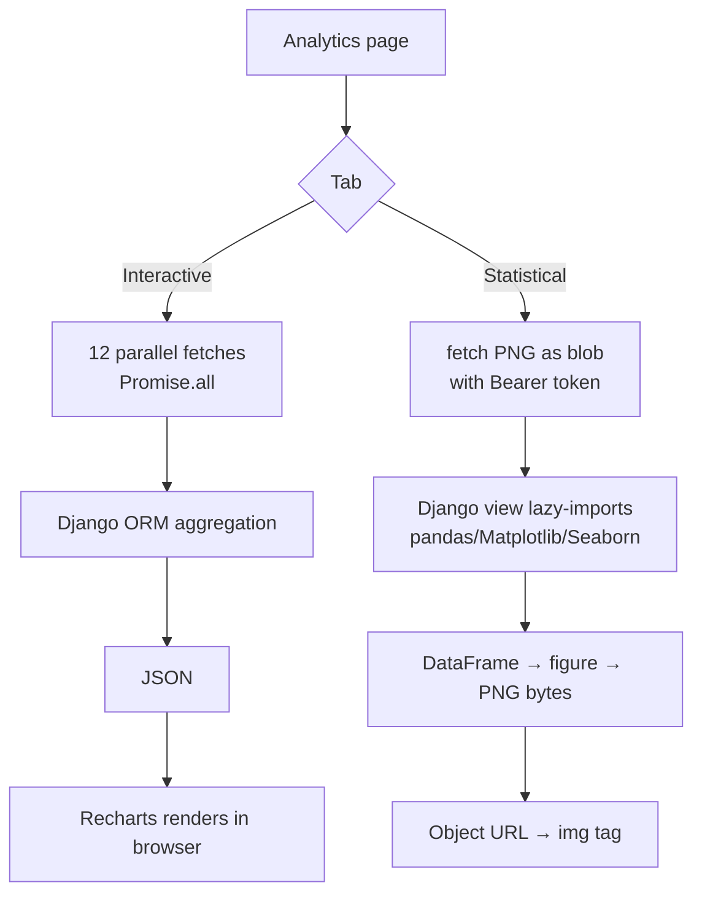

# ElectroShop Management System — Project Workflow & Technical Reference

A full-stack shop management system for an electronics retail business.
**Django REST Framework** serves a JSON API; **Next.js** renders the interface.

This document explains how the whole system works: the architecture, the request
lifecycle, what every feature does, which part of the tech stack does the work,
and how to run and deploy it.

---

## Table of contents

1. [What the system does](#1-what-the-system-does)
2. [Architecture](#2-architecture)
3. [Tech stack, and what each piece is actually used for](#3-tech-stack-and-what-each-piece-is-actually-used-for)
4. [Repository layout](#4-repository-layout)
5. [Data model](#5-data-model)
6. [Authentication: the full flow](#6-authentication-the-full-flow)
7. [API reference](#7-api-reference)
8. [Feature-by-feature workflow](#8-feature-by-feature-workflow)
9. [Frontend architecture](#9-frontend-architecture)
10. [The Voltline design system](#10-the-voltline-design-system)
11. [Bugs found in the previous version and how they were fixed](#11-bugs-found-in-the-previous-version-and-how-they-were-fixed)
12. [Testing](#12-testing)
13. [Running locally](#13-running-locally)
14. [Deployment](#14-deployment)
15. [Troubleshooting](#15-troubleshooting)

---

## 1. What the system does

A shopkeeper signs in and can:

| Area | Capability |
| --- | --- |
| **Inventory** | Add products under categories, set cost and selling price, track stock, see profit per unit and margin, get low-stock alerts |
| **Sales / Billing** | Record a sale, apply tax and discount, auto-generate an invoice number, print the invoice, browse and filter history |
| **Expenses** | Record rent, salaries, bills and other costs against a category and a date |
| **Analytics** | Interactive dashboards (revenue, profit trend, payment mix, best sellers) plus server-rendered statistical charts (distribution, correlation, forecast) |
| **Access control** | Two roles — `Admin` can delete records, `Staff` cannot |

Money is handled end to end: a sale reduces stock and adds revenue, an expense
reduces profit, and every chart is derived from those two tables.

---

## 2. Architecture

Two independently deployable services talking over HTTPS with JSON and JWT.



**Why the split.** The frontend is a static Next.js build that can sit on any
CDN; the backend is a stateless Django process. Neither holds session state —
the JWT in the browser is the entire session — so either side can be restarted
or scaled without affecting the other.

### Request lifecycle



---

## 3. Tech stack, and what each piece is actually used for

Every dependency below earns its place — nothing is listed that the code does
not use.

### Backend

| Technology | Version | What it does **in this project** |
| --- | --- | --- |
| **Python** | 3.11 | Runtime |
| **Django** | 5.2.17 | ORM, migrations, admin, URL routing, settings |
| **Django REST Framework** | 3.16.1 | Serializers, generic CRUD views, permissions, content negotiation, uniform error envelope |
| **djangorestframework-simplejwt** | 5.5.1 | Access/refresh tokens, rotation, blacklist on logout |
| **django-cors-headers** | 4.9.0 | Lets the browser call the API from the frontend origin |
| **dj-database-url** | 3.0.1 | Parses `DATABASE_URL` into Django's `DATABASES` |
| **psycopg2-binary** | 2.9.12 | PostgreSQL driver in production |
| **Gunicorn** | 23.0.0 | WSGI server on Render |
| **WhiteNoise** | 6.9.0 | Serves Django admin static files without a separate CDN |
| **python-dotenv** | 1.1.1 | Loads `backend/.env` in local development |
| **pandas** | 2.3.3 | Reshapes query results for the statistical charts: grouping, date resampling, rolling means, correlation matrix |
| **Matplotlib** | 3.10.9 | Renders those charts to PNG using the headless `Agg` backend |
| **Seaborn** | 0.13.2 | Statistical chart types on top of Matplotlib — `lineplot`, `histplot`, `boxplot`, `heatmap`, `barplot` |
| **NumPy** | 2.4.6 | `polyfit` least-squares line for the revenue forecast |

### Frontend

| Technology | Version | What it does **in this project** |
| --- | --- | --- |
| **Next.js** | 16.1.6 | App Router, route groups, file-based routing, production build |
| **React** | 19.2.3 | Components, hooks, context for auth/theme/toasts |
| **Tailwind CSS** | v4 | All styling, via CSS-first `@theme` design tokens |
| **Recharts** | 3.7 | Interactive browser-side charts — area, bar, donut |

### Where the two charting stacks are used, and why there are two

This is deliberate, not duplication:

| | Interactive tab | Statistical tab |
| --- | --- | --- |
| **Drawn by** | Recharts, in the browser | Matplotlib + Seaborn, on the server |
| **Data path** | JSON from Django ORM aggregation | pandas DataFrame → PNG |
| **Good at** | Hover tooltips, live re-render on theme change, responsive resize | Statistics the browser has no library for: distributions, box plots, Pearson correlation, least-squares forecasting |
| **Endpoint** | `/api/analytics/…` returning JSON | `/api/analytics/charts/<slug>/` returning `image/png` |

---

## 4. Repository layout

```
ElectroShop/
├── render.yaml                    # One-click Render blueprint for both services
├── PROJECT_WORKFLOW.md            # This document
│
├── backend/
│   ├── manage.py
│   ├── requirements.txt           # Pinned
│   ├── runtime.txt                # python-3.11.9
│   ├── start.sh                   # migrate → collectstatic → roles → gunicorn
│   ├── .env.example
│   │
│   ├── backend/
│   │   ├── settings.py            # Env-driven; one file for dev and prod
│   │   ├── test_settings.py       # Forces in-memory SQLite for tests
│   │   ├── urls.py                # /admin/, /api/, /health/
│   │   └── wsgi.py · asgi.py
│   │
│   └── shop/
│       ├── models/                # One file per entity
│       │   ├── category.py · products.py · sale.py · expense.py
│       ├── serializers/           # Validation + JSON shape
│       ├── views/                 # Business logic per domain
│       │   ├── auth_views.py
│       │   ├── category_views.py · products_views.py
│       │   ├── sale_views.py · expense_views.py
│       │   ├── analytics_views.py            # ORM aggregation → JSON
│       │   ├── data_science_analytics.py     # pandas/Matplotlib/Seaborn → PNG
│       │   └── home_views.py                 # API index + health check
│       ├── urls/                  # One URL module per business domain
│       │   ├── auth_urls.py · catalog_urls.py · sale_urls.py
│       │   ├── expense_urls.py · analytics_urls.py
│       │   └── legacy_urls.py     # Old flat paths, kept working
│       ├── permissions.py         # Role checks
│       ├── exceptions.py          # Uniform {detail, errors} error envelope
│       ├── admin.py
│       ├── management/commands/   # ensure_roles, seed_demo_data
│       ├── migrations/
│       └── tests/                 # 74 tests
│
└── frontend/
    └── src/
        ├── app/
        │   ├── layout.js          # Providers: Theme → Toast → Auth
        │   ├── globals.css        # Voltline design tokens
        │   ├── page.js            # Routes to /dashboard or /login
        │   ├── login/ · register/
        │   └── (app)/             # Route group: everything behind auth
        │       ├── layout.js      # Session guard + app shell
        │       ├── dashboard/ · inventory/ · sales/
        │       └── expenses/ · analytics/
        ├── components/
        │   ├── ThemeProvider.js
        │   ├── layout/AppShell.js # Sidebar, top bar, mobile drawer
        │   ├── ui/                # Primitives, Form, Table, Modal, Toast, Icons
        │   └── charts/
        │       ├── ChartKit.js    # Recharts wrappers
        │       └── PythonChart.js # Fetches server PNGs as authed blobs
        └── lib/
            ├── api.js             # HTTP layer, token store, refresh queue
            ├── auth.js            # AuthProvider / useAuth
            └── format.js          # Currency, dates, relative time
```

---

## 5. Data model



### Derived values (not stored, computed on read)

| Field | Formula |
| --- | --- |
| `Product.profit_per_unit` | `selling_price − purchase_price` |
| `Product.margin_percent` | `profit_per_unit / purchase_price × 100` |
| `Product.stock_value` | `purchase_price × stock` |
| `Product.is_low_stock` | `stock ≤ 5` |
| `Sale.subtotal` | `unit_price × quantity` |
| `Sale.tax_amount` | `subtotal × tax_percent / 100` |
| `Sale.total_amount` | `subtotal + tax_amount − discount` |
| `cost_of_goods_sold` | `Σ (quantity × product.purchase_price)` |
| `gross_profit` | `total_sales − cost_of_goods_sold` |
| `net_profit` | `gross_profit − total_expenses` |

### Two deliberate integrity rules

- **`Product.category` is `PROTECT`** — deleting a category that still holds
  products is refused with a clear message instead of silently destroying
  inventory.
- **`Sale.product` is `PROTECT`** — a product that appears in sales history
  cannot be deleted, so past invoices never lose their line item.

### `unit_price` is frozen at sale time

The price is copied onto the `Sale` row when it is created. Changing a
product's price later does not rewrite history, so old invoices still show what
the customer actually paid.

---

## 6. Authentication: the full flow

### The rule

**A token string in `localStorage` is not a session.** The only thing that
proves a session is a `200` from `GET /api/auth/me/`.

### Boot sequence



While `status === "loading"`, the guarded layout renders a splash screen and
**nothing else** — no flash of a dashboard the user is not entitled to see.

### Token lifetimes and rotation

| Token | Lifetime | Stored | Purpose |
| --- | --- | --- | --- |
| Access | 60 min | `localStorage["electroshop.access"]` | Sent as `Authorization: Bearer …` |
| Refresh | 7 days | `localStorage["electroshop.refresh"]` | Exchanged for a new access token |

`ROTATE_REFRESH_TOKENS` and `BLACKLIST_AFTER_ROTATION` are both on: every
refresh issues a **new** refresh token and blacklists the old one. A stolen or
stale refresh token cannot be replayed.

### Single-flight refresh

If ten requests fail with `401` at the same moment, they do **not** trigger ten
refreshes. `lib/api.js` keeps one in-flight promise; the first caller starts the
refresh, the rest await the same promise, then all ten replay with the new
token. Without this, concurrent refreshes race token rotation and log the user
out at random.

### Logout is server-side

`POST /api/auth/logout/` blacklists the refresh token before the browser clears
its storage. Clearing `localStorage` alone would leave a token valid for seven
more days.

### Roles

| Role | Read | Create / edit | Delete |
| --- | --- | --- | --- |
| **Staff** | ✅ | ✅ | ❌ |
| **Admin** | ✅ | ✅ | ✅ |

Enforced by `IsStaffOrAdminCanDelete` on the backend, and mirrored in the UI
(delete buttons are hidden for Staff). The backend check is the one that counts.

---

## 7. API reference

Base URL: `https://<backend>/api`

Every endpoint requires `Authorization: Bearer <access>` **except** those marked
public. Errors always come back as `{"detail": "…", "errors": {…}}`.

### Auth — `/api/auth/`

| Method | Path | Auth | Description |
| --- | --- | --- | --- |
| POST | `/auth/register/` | public | Create account, returns tokens + user |
| POST | `/auth/login/` | public | Returns `{access, refresh, user}` |
| POST | `/auth/refresh/` | public | Returns a new access + rotated refresh |
| POST | `/auth/logout/` | ✅ | Blacklists the supplied refresh token |
| GET | `/auth/me/` | ✅ | Current user + role — **the session check** |
| GET | `/auth/groups/` | public | Roles available on the signup form |

### Catalog — `/api/catalog/`

| Method | Path | Description |
| --- | --- | --- |
| GET, POST | `/catalog/categories/` | List / create |
| GET, PATCH, DELETE | `/catalog/categories/<id>/` | Detail (delete is Admin-only, `409` if products remain) |
| GET, POST | `/catalog/products/` | Supports `?search=`, `?category=`, `?low_stock=1`, `?ordering=` |
| GET, PATCH, DELETE | `/catalog/products/<id>/` | Detail |
| GET | `/catalog/products/low-stock/` | Products at or below the threshold |

### Sales — `/api/sales/`

| Method | Path | Description |
| --- | --- | --- |
| GET, POST | `/sales/` | Supports `?search=`, `?payment_method=`, `?start_date=`, `?end_date=` |
| GET, PATCH, DELETE | `/sales/<id>/` | Editing adjusts stock by the difference; deleting returns stock |
| GET | `/sales/<id>/invoice/` | Printable invoice payload |

### Expenses — `/api/expenses/`

| Method | Path | Description |
| --- | --- | --- |
| GET, POST | `/expenses/` | Supports `?search=`, `?category=`, `?start_date=`, `?end_date=` |
| GET, PATCH, DELETE | `/expenses/<id>/` | Detail |
| GET | `/expenses/categories/` | Suggested + previously used categories |

### Analytics — `/api/analytics/`

**JSON (consumed by Recharts):**

| Path | Returns |
| --- | --- |
| `/analytics/summary/` | All dashboard KPIs in one call |
| `/analytics/sales/daily/` | 7 points, gap-filled |
| `/analytics/sales/weekly/` | 4 points, gap-filled |
| `/analytics/sales/monthly/` | 6 points, gap-filled |
| `/analytics/sales/by-category/` | Revenue and units per category |
| `/analytics/payments/` | Revenue and order count per method |
| `/analytics/top-products/?limit=` | Best sellers by units |
| `/analytics/expenses/daily/`, `/weekly/`, `/by-category/` | Expense series |
| `/analytics/profit-trend/` | Revenue, expenses and profit for 6 months |

**PNG (rendered by Matplotlib/Seaborn):**

| Path | Chart |
| --- | --- |
| `/analytics/charts/` | JSON catalogue of the charts below |
| `/analytics/charts/sales-trend/` | 30-day revenue with a 7-day rolling mean |
| `/analytics/charts/sales-distribution/` | Histogram + box plot of order values |
| `/analytics/charts/correlation/` | Pearson correlation heatmap |
| `/analytics/charts/forecast/` | Least-squares trend projected 3 periods |
| `/analytics/charts/revenue-vs-expense/` | Grouped bars with a net-profit line |

All accept `?theme=dark|light`.

> **Gap filling.** Every series returns a fixed number of points. A day with no
> sales comes back as `0` rather than being omitted, so bars do not silently
> shift and misrepresent the trend.

### Legacy routes

The original flat paths (`/api/products/`, `/api/dashboard/`, `/api/login/`,
`/api/weeklyExpenceAnalysis/`, …) still resolve, aliased onto the same views.
This means the backend can be deployed before the frontend without breaking the
live site. They are deprecated — build new work against the domain routes.

---

## 8. Feature-by-feature workflow

### 8.1 Inventory



**Stack:** React state and modal → `api.products.create()` → DRF
`ProductSerializer` (validates selling ≥ purchase, no negative stock) →
`ProductListCreateView` → ORM → database. The list uses `select_related("category")`
so rendering N products costs one query, not N+1.

**Rules enforced:** selling price cannot be below cost; stock cannot be
negative; category names are unique case-insensitively; a category holding
products cannot be deleted.

### 8.2 Sales and invoicing



**Stock movement lives in exactly one place** — `Sale.save()`. Serializers, the
Django admin and management commands all route through it, so a quantity can
never be counted twice.

**Concurrency:** the product row is locked with `select_for_update()` inside a
transaction, so two simultaneous checkouts cannot both read the same stock
figure and oversell.

**Invoice numbers** are `INV-YYYYMMDD-<zero-padded PK>`. Deriving from the
primary key makes them unique by construction — no "read the last row and add
one" race.

**Editing a sale** adjusts stock by the *difference*. Changing 2 → 5 removes 3
more; changing 6 → 1 returns 5. Switching to a different product returns the
full quantity to the old product first. **Deleting** returns the stock.

### 8.3 Expenses

Expenses can be **backdated**, which is what makes the trend charts meaningful.
Category is free text with suggestions merged from what the shop has already
used. Every expense feeds `net_profit` and the profit-trend chart.

### 8.4 Analytics



The statistical charts require an `Authorization` header, which an ``
cannot send. The frontend therefore fetches each PNG as a **blob** and hands the
DOM an object URL, revoking it on unmount so switching themes does not leak
memory.

**Lazy imports matter for deployment.** pandas, Matplotlib and Seaborn are
imported *inside* the chart functions, not at module load. On a 512 MB Render
instance that keeps roughly 120 MB of plotting libraries out of every Gunicorn
worker that never serves a chart.

---

## 9. Frontend architecture

### Provider tree

```
<html>
  └── inline theme script      ← sets .dark before first paint (no flash)
      └── ThemeProvider
          └── ToastProvider
              └── AuthProvider
                  └── page
```

### Routing

Next.js **route groups** put every authenticated page under `src/app/(app)/`.
The parentheses mean the folder does not appear in the URL, so
`(app)/dashboard/page.js` serves `/dashboard` — but it inherits
`(app)/layout.js`, which is the session guard. Adding a protected page is just
adding a folder; the guard is automatic and cannot be forgotten.

| Route | Auth | Purpose |
| --- | --- | --- |
| `/` | — | Redirects to `/dashboard` or `/login` |
| `/login`, `/register` | public | Credentials |
| `/dashboard` | ✅ | KPIs, 7-day trend, payment mix, best sellers, low stock |
| `/inventory` | ✅ | Product CRUD, categories, filters |
| `/sales` | ✅ | Billing, history, invoices |
| `/expenses` | ✅ | Expense CRUD, weekly and category breakdown |
| `/analytics` | ✅ | Interactive + statistical charts |

### The HTTP layer

`lib/api.js` is the only file that calls `fetch`. It owns the token store, the
`Authorization` header, the single-flight refresh, and error normalisation into
`ApiError` (which carries `status` and per-field `errors`). Pages never touch
`localStorage` and never build a header.

---

## 10. The Voltline design system

Named for the electric-current hairline that runs along the top of raised
surfaces — the small visual signature of the app.

### Semantic tokens

Components never hardcode a colour. They reference a **role**, and the role
resolves differently per theme, so light and dark stay in sync automatically.

| Token | Role |
| --- | --- |
| `app` / `surface` / `raised` | Page background, card, nested card |
| `line` / `line-strong` | Hairline and control borders |
| `ink` / `muted` / `faint` | Primary, secondary, tertiary text |
| `accent` / `accent-soft` / `accent-ink` | Brand cyan, its tint, text on top of it |
| `positive` / `negative` / `warning` / `info` | Status colours |

Defined once in `globals.css` as CSS custom properties, exposed to Tailwind via
`@theme inline` (Tailwind v4 is configured in CSS — there is no
`tailwind.config.js`).

### Dark mode without a flash

An inline script in `<head>` reads `localStorage` and stamps `.dark` on
`<html>` **before first paint**. Doing this in a React effect would paint light
first and snap to dark. The toggle icon is swapped by CSS rather than JS, so the
server and client render identical markup and hydration never mismatches.

### Component inventory

`Button` · `Card` · `CardHeader` · `CardBody` · `StatCard` · `Badge` · `Alert` ·
`EmptyState` · `Skeleton` · `Spinner` · `PageHeader` · `Field` · `Input` ·
`Select` · `Textarea` · `SearchInput` · `FormGrid` · `DataTable` ·
`DefinitionList` · `Modal` · `ConfirmDialog` · `ToastProvider` — plus a
hand-rolled inline SVG icon set (no icon package to install or ship).

### Accessibility and responsiveness

- Sidebar on desktop collapses to a drawer below `lg`
- Wide tables scroll inside their own container; the page body never scrolls sideways
- `aria-current` on the active nav item, `aria-selected` on tabs, `role="dialog"` + escape-to-close + scroll lock on modals, `aria-label` on every icon-only button
- Visible focus ring on all interactive elements
- All animation disabled under `prefers-reduced-motion`

---

## 11. Bugs found in the previous version and how they were fixed

These were real defects in the deployed application, each now covered by a test.

### 🔴 Every analytics endpoint was public

`REST_FRAMEWORK` had no `DEFAULT_PERMISSION_CLASSES`, so any view without an
explicit `permission_classes` defaulted to `AllowAny`. Verified against the live
backend: `GET /api/dashboard/` and every `/api/analytics/*` route returned `200`
with **no token**, publishing total revenue, profit and best sellers to anyone
with the URL.

**Fix:** `DEFAULT_PERMISSION_CLASSES = [IsAuthenticated]` — closed by default,
with public endpoints opting out explicitly. Guarded by a test that asserts 14
endpoints return `401` anonymously.

### 🔴 Selling 2 units removed 4 from stock

`SaleSerializer.create()` subtracted the quantity, and then `Sale.save()`
subtracted it **again**.

**Fix:** all stock movement moved into `Sale.save()` alone; the serializer only
validates. Migration `0003` also clamps any stock the old bug drove negative.
Verified through the real UI: a product with 62 in stock went to **59** after
selling 3, not 56.

### 🔴 An expired or invalid token still opened the dashboard

`dashboard/layout.js` checked only that *some string* existed under
`access_token`, then returned `children` unconditionally. Any value — including
a hand-typed one — walked straight in, and the user was never asked to sign in
again until an unrelated API call happened to fail.

**Fix:** `AuthProvider` validates against `GET /auth/me/` on boot and the
guarded layout renders nothing until that resolves. Verified in the browser: a
planted garbage token now clears storage and redirects to `/login`.

### 🟠 The logout button called an endpoint that did not exist

`POST /api/logout/` returned `404`. Logout only cleared `localStorage`, leaving
the refresh token valid on the server for a full day.

**Fix:** real `/api/auth/logout/` that blacklists the refresh token, plus
`token_blacklist` installed and rotation enabled.

### 🟠 The Matplotlib/Seaborn feature did not exist

`data_science_analytics.py` was **100% commented out**, and matplotlib, seaborn
and pandas were not in `requirements.txt` at all — the project's headline
"analytics charts (Matplotlib/Seaborn)" could not have run.

**Fix:** five charts reimplemented with lazy imports and a headless backend, the
libraries pinned, and a `PNGRenderer` added — without it DRF content negotiation
answered `Accept: image/png` with `406 Not Acceptable` and the gallery rendered
five error tiles.

### 🟠 `SECURE_SSL_REDIRECT` risked an infinite redirect loop

`SECURE_SSL_REDIRECT = True` was set without `SECURE_PROXY_SSL_HEADER`. Render
terminates TLS at its proxy and forwards plain HTTP, so Django never sees a
request as secure and redirects forever.

**Fix:** `SECURE_PROXY_SSL_HEADER = ("HTTP_X_FORWARDED_PROTO", "https")`.

### 🟠 Unpinned requirements + a setting removed in Django 5.1

`requirements.txt` listed bare `django`, so a deploy could resolve Django 6.x —
where `STATICFILES_STORAGE` no longer exists, breaking `collectstatic`.

**Fix:** every dependency pinned; `STATICFILES_STORAGE` replaced with `STORAGES`.

### 🟡 Other fixes

| Issue | Fix |
| --- | --- |
| `/` and `/login` were byte-identical duplicate login pages | `/` now routes based on session state |
| Days with no sales vanished from charts, distorting trends | Every series is gap-filled |
| Expenses used `auto_now_add`, so they could not be backdated | Changed to `default=timezone.now` |
| Deleting a category cascade-deleted its products | Changed to `PROTECT` with a `409` and a clear message |
| Invoice numbers used a racy "last row + 1" lookup | Derived from the primary key |
| `pytest.ini` pointed at a `test_settings` module and `tests/` dir that did not exist | Both created; suite runs |
| `profit = sales − expenses` ignored cost of goods | Now reports COGS, gross profit and net profit separately |
| Errors surfaced in three different DRF shapes | Uniform `{detail, errors}` envelope |
| No rate limiting on login | `20/min` throttle on auth endpoints |

---

## 12. Testing

**74 backend tests**, all passing.

```bash
cd backend && python manage.py test shop.tests --settings=backend.test_settings
```

| File | Covers |
| --- | --- |
| `test_auth.py` | Login, refresh, rotation, blacklist-on-logout, garbage tokens, registration, **and that 14 endpoints refuse anonymous access** |
| `test_sales.py` | Single stock deduction, overselling, edit/delete restock, product swap, tax and discount maths, frozen unit price, invoice uniqueness, filters |
| `test_inventory.py` | Product and category CRUD, margins, low stock, role-based delete, `PROTECT` behaviour |
| `test_analytics.py` | Expense CRUD, KPI maths, gap filling, empty-database safety, all five PNG charts, `Accept: image/png` negotiation |

`test_settings.py` pins `DATABASES` to in-memory SQLite so a test run can never
touch the deployed database.

**Frontend:** `npm run build` (compiles + type-checks) and `npx eslint src`
(clean, including the React Compiler's `set-state-in-effect` rule).

---

## 13. Running locally

### Backend

```bash
cd backend
python -m venv .venv
.venv/Scripts/activate          # macOS/Linux: source .venv/bin/activate
pip install -r requirements.txt
cp .env.example .env            # set SECRET_KEY, keep USE_SQLITE=True
python manage.py migrate
python manage.py createsuperuser
python manage.py runserver 8000
```

Optional — fill the shop with realistic data so the charts have something to show:

```bash
python manage.py seed_demo_data --days 60 --sales 160 --fresh
```

### Frontend

```bash
cd frontend
npm install
echo "NEXT_PUBLIC_API_URL=http://127.0.0.1:8000/api" > .env.local
npm run dev
```

Open `http://localhost:3000`.

---

## 14. Deployment

Both services deploy from `render.yaml`: **New → Blueprint** in the Render
dashboard, pointed at this repository.

### Backend environment variables

| Variable | Value |
| --- | --- |
| `SECRET_KEY` | Generated by Render |
| `DEBUG` | `False` |
| `USE_SQLITE` | `False` |
| `DATABASE_URL` | Your Postgres connection string (Neon / Render / Supabase) |
| `ALLOWED_HOSTS` | `your-backend.onrender.com,localhost,127.0.0.1` |
| `CORS_ALLOWED_ORIGINS` | **The frontend origin.** Wrong value here blocks every API call |
| `CSRF_TRUSTED_ORIGINS` | Same as above |
| `DJANGO_SUPERUSER_PASSWORD` | Optional — `start.sh` creates the first admin only if set |

Render's `RENDER_EXTERNAL_HOSTNAME` is trusted automatically, so renaming the
service will not cause a `DisallowedHost` error.

### Frontend environment variable

| Variable | Value |
| --- | --- |
| `NEXT_PUBLIC_API_URL` | `https://your-backend.onrender.com/api` |

> ⚠️ `NEXT_PUBLIC_*` values are **baked in at build time**, not read at runtime.
> Changing this requires a rebuild, not just a restart.

### What `start.sh` does

```
migrate  →  collectstatic  →  ensure_roles  →  gunicorn (2 workers, 4 threads)
```

Two workers, not three: the free tier has 512 MB and Matplotlib is loaded per
worker on demand.

### Deployment order

1. Deploy the **backend** first — legacy routes keep the old frontend working
   during the gap.
2. Set `CORS_ALLOWED_ORIGINS` to the frontend origin.
3. Deploy the **frontend** with `NEXT_PUBLIC_API_URL` set before the build runs.

### Migration safety

Migration `0003` adds `UNIQUE` constraints to `Category.name` and
`Sale.invoice_number`. Because the live database predates them and may hold
duplicates, **each constraint is preceded by a `RunPython` step that
de-duplicates the existing rows first**. Without that ordering the migration
would abort mid-deploy.

---

## 15. Troubleshooting

| Symptom | Cause | Fix |
| --- | --- | --- |
| Every API call fails in the browser, works in curl | Frontend origin missing from `CORS_ALLOWED_ORIGINS` | Add it and redeploy the backend |
| Infinite redirect loop | `SECURE_SSL_REDIRECT` without the proxy header | Already fixed; confirm `DEBUG=False` and redeploy |
| `DisallowedHost` | Domain not in `ALLOWED_HOSTS` | Add it, or rely on `RENDER_EXTERNAL_HOSTNAME` |
| Charts show "Could not render this chart" | Plotting libraries missing | Confirm the build installed `requirements.txt` |
| `406 Not Acceptable` on a chart URL | Backend predates the `PNGRenderer` fix | Redeploy the backend |
| Frontend calls `localhost` in production | `NEXT_PUBLIC_API_URL` not set at **build** time | Set it, then rebuild |
| Signup rejects every role | `Admin`/`Staff` groups missing | `python manage.py ensure_roles` |
| First request after idle takes ~50 s | Render free tier cold start | Expected; upgrade to remove |
| Charts and dashboard are empty | No data yet | `python manage.py seed_demo_data` |

---

## Quick reference

```bash
# Backend
python manage.py runserver 8000
python manage.py test shop.tests --settings=backend.test_settings
python manage.py seed_demo_data --days 60 --sales 160 --fresh
python manage.py ensure_roles

# Frontend
npm run dev
npm run build
npx eslint src
```

| | |
| --- | --- |
| API index | `GET /api/` |
| Health check | `GET /health/` |
| Django admin | `/admin/` |
