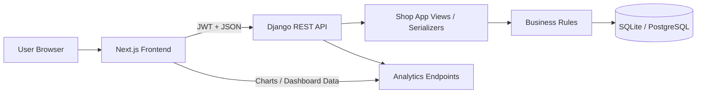
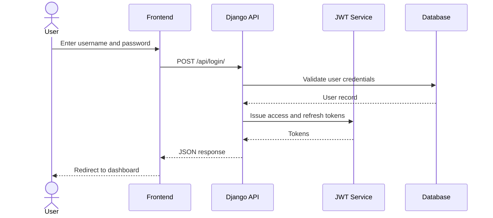
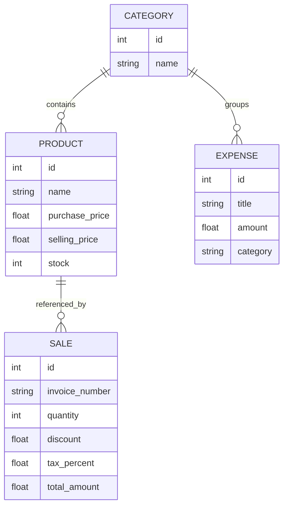
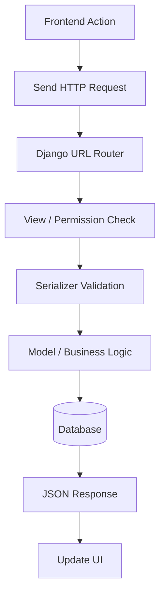
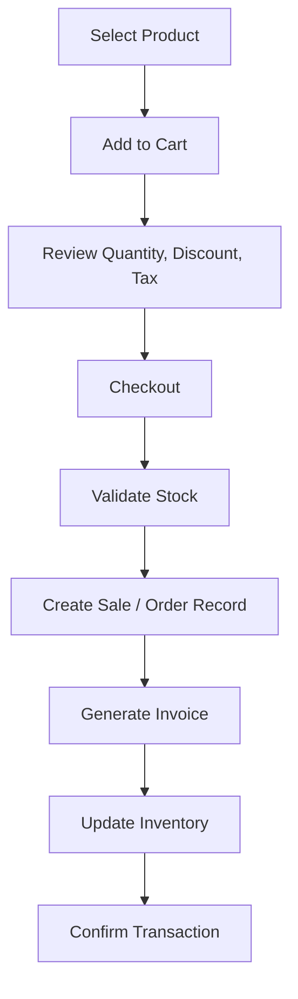

# Software Requirements Specification

## ElectroShop - Electronic Shop Management System

**Document Type:** IEEE-style SRS  
**Format:** Markdown  
**Project Domain:** E-commerce and Retail Management  
**Primary Stack:** React.js, Tailwind CSS, Axios, React Router, Django, Django REST Framework, SQLite, JWT, Pytest  
**Deployment Target:** Render / Vercel  
**Prepared For:** Academic submission, portfolio, GitHub documentation, and interview showcase

**Prepared By:** Manoj  
**Document Date:** 2026-05-07  
**Status:** Final Submission Draft

---

## Cover Page

**ELECTROSHOP - ELECTRONIC SHOP MANAGEMENT SYSTEM**  
**SOFTWARE REQUIREMENTS SPECIFICATION**  
**FINAL YEAR PROJECT SUBMISSION DOCUMENT**

| Field | Value |
| --- | --- |
| Project Name | ElectroShop - Electronic Shop Management System |
| Document Type | Software Requirements Specification |
| Prepared By | Manoj |
| Document Date | May 7, 2026 |
| Version | 1.0 |
| Status | Final Submission Draft |
| Domain | Retail and E-commerce Management |
| Document Style | IEEE-inspired academic report |
| Purpose | University submission and portfolio presentation |

### Submission Sheet

| Field | Details |
| --- | --- |
| Student Name | Manoj |
| Project Title | ElectroShop - Electronic Shop Management System |
| Course / Program | [Add Course Name] |
| Department | [Add Department Name] |
| Institution | [Add Institution Name] |
| Academic Year | 2025-2026 |
| Guide / Supervisor | [Add Supervisor Name] |

---

## Abstract

ElectroShop is a web-based electronic shop management system designed to support the operational activities of a retail business. The system centralizes product management, inventory tracking, sales recording, expense monitoring, and analytics within a single platform. By combining a React-based frontend with a Django REST Framework backend, the application provides a practical and structured approach to shop administration.

This Software Requirements Specification defines the scope, functional requirements, external interfaces, quality attributes, data design, architecture, testing strategy, security considerations, and deployment plan for the system. The document is intended to serve as a formal reference for academic submission, implementation, evaluation, and future enhancement.

## Table of Contents

The following table of contents provides the main structure of the report. It is arranged in a standard academic format so that each section can be reviewed sequentially and printed cleanly in PDF form. In a final PDF export, this page should appear immediately after the abstract and before the document body.

- [1. Introduction](#1-introduction)
- [2. Overall Description](#2-overall-description)
- [3. System Features](#3-system-features)
- [4. External Interface Requirements](#4-external-interface-requirements)
- [5. Non-Functional Requirements](#5-non-functional-requirements)
- [6. Database Design](#6-database-design)
- [7. System Architecture](#7-system-architecture)
- [8. UML Diagram Explanation](#8-uml-diagram-explanation)
- [9. Testing Strategy](#9-testing-strategy)
- [10. Security Considerations](#10-security-considerations)
- [11. Deployment Details](#11-deployment-details)
- [12. Future Enhancements](#12-future-enhancements)
- [13. Conclusion](#13-conclusion)
- [Appendix A. Mermaid Diagrams](#appendix-a-mermaid-diagrams)
- [Appendix B. Suggested Diagrams](#appendix-b-suggested-diagrams)
- [Appendix C. Suggested Screenshot Placement](#appendix-c-suggested-screenshot-placement)

---

## Document Control

| Field | Value |
| --- | --- |
| Project Name | ElectroShop - Electronic Shop Management System |
| Document Version | 1.0 |
| Document Status | Final Draft |
| Standard Style | IEEE-inspired SRS |
| Target Audience | Client, evaluator, developer, reviewer |

### Document Conventions

- Section numbering follows IEEE-style hierarchical numbering.
- Requirements are written in concise, testable language.
- Tables are used for structured requirements, interfaces, and mappings.
- Mermaid diagrams are embedded to provide implementation-ready visual references.

### Revision History

| Version | Date | Description |
| --- | --- | --- |
| 1.0 | 2026-05-07 | Initial submission-ready SRS draft for ElectroShop. |

---

## 1. Introduction

### 1.1 Purpose

This Software Requirements Specification defines the functional and non-functional requirements of ElectroShop, a web-based system for retail inventory, sales, expense tracking, reporting, and analytics. The document is intended to provide a clear baseline for development, evaluation, and future enhancement.

The document serves as a single reference for stakeholders, developers, testers, and evaluators, ensuring that all parties share the same understanding of the intended system behaviour.

### 1.2 Scope

ElectroShop provides a centralized platform for retail operations. The solution combines a modern frontend with a REST API backend for business logic, persistence, and analytics. It is designed to support the day-to-day activities of an electronic shop while remaining suitable for academic demonstration and controlled expansion.

The current codebase supports the following baseline capabilities:

- User registration and JWT-based login
- Product, category, expense, and sales management
- Inventory tracking through stock updates
- Dashboard analytics and reporting endpoints
- Role-aware access control and authenticated API consumption

Cart and order workflows are included as the commerce scope and may be added as the platform expands. This makes the specification more complete from a business perspective and more representative of a real-world retail application.

### 1.3 Definitions

| Term | Meaning |
| --- | --- |
| API | Application Programming Interface |
| JWT | JSON Web Token |
| DRF | Django REST Framework |
| CRUD | Create, Read, Update, Delete |
| UI | User Interface |
| ER Diagram | Entity-Relationship Diagram |
| NFR | Non-Functional Requirement |
| SRS | Software Requirements Specification |

### 1.4 Acronyms

| Acronym | Expansion |
| --- | --- |
| RBAC | Role-Based Access Control |
| CI/CD | Continuous Integration and Continuous Delivery |
| CORS | Cross-Origin Resource Sharing |
| CSRF | Cross-Site Request Forgery |
| REST | Representational State Transfer |
| KPI | Key Performance Indicator |

### 1.5 References

- IEEE SRS guidance and software requirements documentation practices
- [README.md](README.md)
- [HLD.md](HLD.md)
- [LLD.md](LLD.md)
- [LLD_DIA.md](LLD_DIA.md)
- [LLD_UML.md](LLD_UML.md)
- [PROJECT_REPORT.md](PROJECT_REPORT.md)
- [USER_MANUAL.md](USER_MANUAL.md)
- [DEPLOYMENT.md](DEPLOYMENT.md)
- [COMPREHENSIVE_REVIEW.md](COMPREHENSIVE_REVIEW.md)
- [tests.md](tests.md)
- [ElectroShop_lld.puml](backend/ElectroShop_lld.puml)

### 1.6 Overview

This document is organized into thirteen major sections. It begins with the business context and system scope, then describes the operating environment, feature-level requirements, external interfaces, quality attributes, database design, architecture, testing strategy, security controls, deployment plan, future scope, and conclusion. The intent is to provide a complete and academically acceptable specification that can be reviewed by evaluators, implemented by developers, and used as a reference during presentation, maintenance, and assessment.

### 1.7 Problem Statement

ElectroShop addresses the operational difficulty of managing an electronic retail shop through manual registers, spreadsheets, or disconnected tools. In such environments, product stock, sales, and expenses are often maintained separately, which increases the risk of inconsistent records, delayed reporting, and human error. The absence of a centralized system makes it difficult to monitor inventory in real time, produce reliable summaries, and enforce role-based access for different staff members. For a final-year project, this problem is appropriate because it is realistic, clearly bounded, and directly aligned with common business automation requirements.

The proposed system resolves these issues by combining authentication, inventory management, sales processing, and analytics within a single web-based platform. This approach improves data consistency, reduces manual effort, and provides a more professional foundation for retail operations. It also demonstrates the use of structured software engineering practices such as modular design, validation, testing, and documentation.

### 1.8 Project Objectives

- Provide a centralized platform for managing shop operations.
- Maintain accurate product and stock records.
- Support secure login, registration, and role-based access.
- Record sales and expenses in a consistent format.
- Generate dashboards and reports for operational review.
- Provide a clean frontend and a reusable REST API backend.

These objectives ensure that the project remains focused on solving a genuine operational problem while still being feasible for a semester-based academic timeline.

---

## 2. Overall Description

### 2.1 Product Perspective

ElectroShop is a client-server web application with a Django REST API backend and a React frontend. The backend is responsible for data persistence, authentication, validation, business rules, and analytical aggregation. The frontend provides the user-facing interface through which shop operators can manage daily transactions in a structured and responsive way.

From a system perspective, the application behaves as a layered business information system. User actions are captured in the browser, transmitted to the backend through REST endpoints, validated against business rules, and then stored in the database. This separation of concerns improves maintainability and allows the interface to evolve without rewriting the core logic.

The current repository is structured as a two-tier application.

This separation improves clarity because presentation logic and business logic are handled independently, which is a common and recommended pattern in modern web development.

| Layer | Technology | Responsibility |
| --- | --- | --- |
| Frontend | React.js, Tailwind CSS, Axios, React Router | User interface and form workflows |
| Backend | Django, DRF, SimpleJWT | Business logic, authentication, and API exposure |
| Database | SQLite in development | Transaction storage, inventory and sales data |
| Testing | Pytest | Unit, integration, and API verification |

### 2.2 Product Functions

ElectroShop provides the following high-level functions. These functions represent the core operational scope of the system and form the basis for both implementation and testing:

- Authenticate users using JWT tokens
- Register new users with secure credential handling
- Create, update, and delete products
- Organize products using categories
- Track inventory and reduce stock on sale creation
- Record sales with invoice generation and payment selection
- Record expenses for operational analysis
- Show dashboard summaries and sales analytics
- Enforce access control through authenticated API access
- Support extensible cart and order workflows for retail commerce

Each function is designed to reduce manual work in a retail environment. Authentication protects the system from unauthorized access, product and inventory functions maintain accurate stock records, sales and expense functions support daily transactions, and analytics functions provide management with a reliable view of system activity.

### 2.3 User Classes

| User Class | Description | Primary Access |
| --- | --- | --- |
| Administrator | Manages system configuration, users, and master data | Full access |
| Staff / Manager | Maintains products, categories, and operational records | Create and update access |
| Cashier / Operator | Records sales and customer transactions | Transaction access |
| Viewer / Auditor | Reviews reports and analytics | Read-only access |
| Customer | Uses the storefront for browsing and order placement | Frontend access |

### 2.4 Operating Environment

| Component | Environment |
| --- | --- |
| Browser | Modern Chromium, Firefox, or Edge |
| Frontend Runtime | React.js application on Vercel or similar hosting |
| Backend Runtime | Python 3.11+ with Django application hosting |
| Database | SQLite for development, PostgreSQL recommended for production |
| API Transport | HTTPS in production, HTTP in local development |

### 2.5 Design Constraints

The system is constrained by the technologies already selected for the project and by the need to preserve data consistency during transactional operations.

- The backend must remain compatible with Django REST Framework conventions.
- JWT authentication must be preserved for protected routes.
- The frontend must consume API endpoints asynchronously.
- Stock reduction and restoration must remain transaction-safe.
- Deployment must support static file handling and environment-based configuration.
- The system should remain maintainable for academic and production use.

In addition, the design should remain simple enough for a final-year project while still demonstrating professional software engineering practices such as modularity, validation, and testability.

### 2.6 Assumptions and Dependencies

| Item | Assumption / Dependency |
| --- | --- |
| Authentication | Users authenticate through JWT token exchange |
| Environment Variables | Backend and frontend settings are stored outside source code |
| Database | SQLite is acceptable for development; PostgreSQL is preferred for production |
| Cart and Order Scope | Cart and order flows extend the current sales workflow |
| Network | Users have browser access to the deployed UI and API |
| Deployment | Frontend and backend may be deployed separately |

The system assumes that users will operate through a modern browser and that the backend service will remain available during normal business hours. It also assumes that the database schema will be managed through Django migrations and that environment-specific values will be supplied through configuration files rather than hard-coded values.

---

## 3. System Features

### 3.1 Login System

The login system is the entry point to the platform. It verifies a user’s identity, creates an authenticated session, and controls access to protected views and APIs. Without successful authentication, the user cannot access the operational modules of the application.

| Attribute | Specification |
| --- | --- |
| Description | Authenticates users using username and password, returning JWT tokens upon successful login. |
| Inputs | Username, password |
| Outputs | Access token, refresh token, authenticated session |
| Preconditions | User must already be registered |
| Postconditions | User is authenticated and redirected to protected pages |
| Functional Requirements | FR-LOGIN-01 Verify credentials. FR-LOGIN-02 Issue JWT tokens. FR-LOGIN-03 Reject invalid credentials. FR-LOGIN-04 Enforce authenticated access to protected routes. |

### 3.2 Registration System

The registration system enables the creation of new accounts with validation rules that prevent duplicate or incomplete user data. It is intended to support controlled onboarding of staff or other authorized users, depending on the deployment policy.

| Attribute | Specification |
| --- | --- |
| Description | Allows new users to create an account through the registration endpoint and frontend form. |
| Inputs | Username, email, password, role information where applicable |
| Outputs | New user record, success response |
| Preconditions | Username and email must be unique as enforced by backend validation |
| Postconditions | User account is created and can log in |
| Functional Requirements | FR-REG-01 Validate user data. FR-REG-02 Store credentials securely. FR-REG-03 Return meaningful validation errors. |

### 3.3 Product Module

The product module maintains the primary stock catalogue of the system. It stores each product with its category, purchase price, selling price, and available quantity, allowing the shop to manage both commercial and inventory data from a single source of truth.

| Attribute | Specification |
| --- | --- |
| Description | Manages product master data including category, purchase price, selling price, and stock quantity. |
| Inputs | Product name, category, purchase price, selling price, stock |
| Outputs | Product records, updated inventory data |
| Preconditions | Category must exist before product creation |
| Postconditions | Product list is updated and inventory values are persisted |
| Functional Requirements | FR-PROD-01 Create product. FR-PROD-02 Update product. FR-PROD-03 Delete product. FR-PROD-04 Validate numeric inventory fields. FR-PROD-05 Show product listings through API. |

### 3.4 Cart Module

The cart module represents the temporary holding area for selected products before checkout. Although the current implementation is sales-driven, the cart concept is included in the specification because it reflects the natural commerce workflow expected in a retail system and provides a clear path for extension.

| Attribute | Specification |
| --- | --- |
| Description | Provides a temporary shopping layer for accumulating selected products before order placement. This is the commerce-oriented extension of the current sales flow. |
| Inputs | Selected products, quantities, discount rules, tax rules |
| Outputs | Cart line items, cart total, checkout-ready data |
| Preconditions | Products must be available and in stock |
| Postconditions | Cart state is ready for checkout or order creation |
| Functional Requirements | FR-CART-01 Add item to cart. FR-CART-02 Update quantity. FR-CART-03 Remove item from cart. FR-CART-04 Compute subtotal and taxes. |

### 3.5 Order Module

The order module finalizes the commercial transaction after the user confirms the cart. It records the purchased items, generates the invoice reference, updates stock, and preserves the transaction history for later auditing or reporting.

| Attribute | Specification |
| --- | --- |
| Description | Finalizes a purchase from the cart, generates an order record, and updates stock and status information. The current codebase already implements sales persistence and invoice generation, which serves as the operational basis for this module. |
| Inputs | Cart content, customer information, payment method, order status |
| Outputs | Order record, invoice number, payment summary |
| Preconditions | Cart must contain at least one valid item |
| Postconditions | Inventory is updated and order history is stored |
| Functional Requirements | FR-ORD-01 Create order from cart. FR-ORD-02 Generate invoice number. FR-ORD-03 Persist payment details. FR-ORD-04 Update order status. FR-ORD-05 Restore stock when an order is cancelled or deleted. |

### 3.6 Admin Module

The admin module provides supervisory control over the system. It is responsible for operational oversight, record maintenance, and visibility into business activity through dashboards and analytics.

| Attribute | Specification |
| --- | --- |
| Description | Provides administrative oversight for master data, user access, and analytics. |
| Inputs | Admin actions, dashboard filters, user permissions |
| Outputs | Reports, configuration changes, access decisions |
| Preconditions | User must be authenticated and authorized |
| Postconditions | Administrative changes are stored and auditable |
| Functional Requirements | FR-ADM-01 Access dashboards. FR-ADM-02 Manage records. FR-ADM-03 View business summaries. FR-ADM-04 Restrict sensitive actions by role. |

### 3.7 Inventory Module

The inventory module ensures that stock values remain synchronized with business transactions. When a sale is recorded, stock decreases; when a transaction is removed or reversed, stock is restored. This module is central to preventing overselling and maintaining reliable inventory levels.

| Attribute | Specification |
| --- | --- |
| Description | Tracks product stock levels and updates quantities automatically when sales or orders are processed. |
| Inputs | Product stock changes, sale quantity, cancellation events |
| Outputs | Updated stock value, low-stock indicators |
| Preconditions | Product must exist in the system |
| Postconditions | Stock is consistently synchronized with transactions |
| Functional Requirements | FR-INV-01 Decrease stock on sale creation. FR-INV-02 Restore stock on delete/cancel. FR-INV-03 Prevent overselling. FR-INV-04 Expose current inventory state through APIs. |

### 3.8 Search Module

The search module improves usability by allowing users to locate products and related records quickly. It reduces the effort required to navigate large datasets and is especially important in a retail environment where users need to act quickly during sales or inventory checks.

| Attribute | Specification |
| --- | --- |
| Description | Enables users to locate products or operational records by keyword or filter criteria. |
| Inputs | Search keywords, category filters, status filters |
| Outputs | Filtered result set |
| Preconditions | Data must exist in the underlying tables |
| Postconditions | Matching records are displayed to the user |
| Functional Requirements | FR-SRCH-01 Search products by name. FR-SRCH-02 Filter by category. FR-SRCH-03 Support front-end filtering for faster navigation. |

### 3.9 API Module

The API module exposes the system’s business functions in a structured and reusable form. It supports communication between the frontend and backend and also makes the application suitable for later integration with third-party systems or mobile clients.

| Attribute | Specification |
| --- | --- |
| Description | Exposes system functionality through REST endpoints for frontend consumption and integration support. |
| Inputs | HTTP requests, JSON payloads, authentication tokens |
| Outputs | JSON responses, HTTP status codes |
| Preconditions | Endpoint path and method must be valid |
| Postconditions | Requested operation is executed or rejected with a controlled error message |
| Functional Requirements | FR-API-01 Provide CRUD APIs. FR-API-02 Protect endpoints using authentication. FR-API-03 Return consistent response structures. FR-API-04 Support analytics endpoints. |

### 3.10 Key Backend Endpoints

| Area | Example Endpoints |
| --- | --- |
| Authentication | `/api/register/`, `/api/login/`, `/api/refresh/`, `/api/groups/` |
| Products | `/api/products/`, `/api/products/{id}/` |
| Categories | `/api/categories/` |
| Sales | `/api/sales/`, `/api/sales/{id}/` |
| Expenses | `/api/expenses/`, `/api/expenses/{id}/` |
| Analytics | `/api/analytics/summary/`, `/api/analytics/daily-sales/`, `/api/analytics/weekly-sales/`, `/api/analytics/monthly-sales/`, `/api/analytics/payment-breakdown/`, `/api/analytics/top-products/`, `/api/analytics/expenses/`, `/api/weeklyExpenceAnalysis/` |

---

## 4. External Interface Requirements

### 4.1 User Interfaces

The system user interface must be clean, responsive, and suitable for routine retail work. The interface should minimize unnecessary navigation and present data in a form that supports quick decision-making.

- Responsive login and registration forms
- Dashboard with KPI cards and charts
- Product and inventory management pages
- Sales and expense input forms
- Analytics and reporting pages

### 4.2 Hardware Interfaces

The system does not require specialized hardware. It should run on standard desktop or laptop devices with a modern browser. In a production setting, performance requirements will depend on the number of concurrent users, transaction frequency, and the volume of records stored in the database.

### 4.3 Software Interfaces

The application interacts with a standard web and backend software stack.

| Interface | Purpose |
| --- | --- |
| Browser | Access the frontend application |
| Django REST API | Backend service layer |
| JWT Library | Token-based authentication |
| Database Engine | Persistent storage |
| Pytest | Test execution |

### 4.4 Communication Interfaces

The application communicates over standard web protocols and uses JSON as the primary exchange format.

- HTTPS for production communication
- JSON over REST for application data exchange
- CORS-enabled browser requests between frontend and backend domains

---

## 5. Non-Functional Requirements

The non-functional requirements define the quality attributes of the system. These requirements are important because a system may be functionally correct but still fail in practice if it is slow, insecure, hard to maintain, or difficult to use.

| Category | Requirement |
| --- | --- |
| Performance | Frequently used API responses should return within acceptable web latency under normal load. |
| Scalability | The architecture should support moving from SQLite to PostgreSQL without redesigning the application layer. |
| Reliability | Sale transactions must preserve stock consistency and avoid partial writes. |
| Availability | The deployed application should remain accessible during standard business hours with minimal downtime. |
| Security | Authentication, authorization, input validation, and secret management must be enforced. |
| Maintainability | Code should remain modular, testable, and organized by domain responsibility. |
| Portability | The system should run on standard Linux-based hosting environments and common browser platforms. |
| Usability | The interface should be responsive, readable, and suitable for non-technical retail users. |

These attributes should be verified during development and testing because they directly influence the professional quality of the final system.

---

## 6. Database Design

### 6.1 ER Diagram Explanation

The database is centered on product catalog and transaction records. Categories group products, products are linked to sales, and each sale affects inventory levels immediately. Expenses are stored separately to support reporting and financial analysis. Authentication data is handled through Django’s built-in user and group system, which supports secure access control.

This structure keeps the core business entities distinct while still allowing them to interact through foreign keys and application logic. The design is intentionally simple so that it remains understandable for academic reviewers while still reflecting real-world system behaviour.

### 6.2 Main Tables

| Table | Purpose | Key Fields |
| --- | --- | --- |
| Category | Stores product categories | id, name |
| Product | Stores inventory items | id, name, category_id, purchase_price, selling_price, stock, created_at |
| Sale | Stores sale transactions | id, invoice_number, product_id, quantity, discount, tax_percent, total_amount, payment_method, customer_name, sale_date |
| Expense | Stores cost entries | id, title, amount, category, date |
| User | Stores user accounts | id, username, password, email |
| Group | Stores access roles | id, name |

### 6.3 Relationships

The following relationships describe how the system data is connected:

| Relationship | Description |
| --- | --- |
| Category to Product | One category can contain many products. |
| Product to Sale | One product can appear in many sales. |
| Product to Sale Stock Logic | Sale creation reduces product stock; deletion restores it. |
| User to Group | Users may belong to role-based groups. |

### 6.4 Data Flow

1. User submits a request from the frontend.
2. API validates the payload and authenticates the token.
3. Business logic updates the corresponding model.
4. Database persists the change.
5. JSON response is returned to the frontend.

This flow applies to most operations in the system, including login, product creation, sales processing, and analytics retrieval. The same request lifecycle helps keep the application predictable and easier to debug.

### 6.5 Implementation Note

The current codebase uses direct sale processing rather than a persistent cart/order schema. This is acceptable for the present implementation because the primary operational need is to record sales and update inventory safely. If the platform is expanded into a full e-commerce application, cart and order tables can be introduced without changing the core product and sale foundations.

---

## 7. System Architecture

### 7.1 Frontend Architecture

The frontend is organized using the React app structure with route-based pages such as login, register, dashboard, and analytics. It uses authenticated API calls to fetch protected data and relies on browser storage for session persistence. From a design perspective, the frontend is responsible only for presentation and user interaction, while all critical business logic remains on the backend.

### 7.2 Backend Architecture

The backend is a Django project with a dedicated `shop` application. The application is split into models, serializers, views, permissions, and routing to keep business logic maintainable and testable. This modular structure also makes it easier to expand the system and to test each responsibility independently.

### 7.3 API Flow

1. Frontend submits a request to a REST endpoint.
2. Django resolves the route in `shop.urls`.
3. The view validates input and permissions.
4. The serializer or model logic processes the transaction.
5. The response is returned as JSON.

This flow is used consistently across modules so that the application behaves in a predictable and standardized manner.

### 7.4 Authentication Flow

1. User enters credentials on the login screen.
2. Backend validates the credentials using JWT authentication.
3. Access and refresh tokens are returned.
4. Frontend stores the tokens and includes the access token in protected requests.
5. Protected routes and APIs reject requests without valid credentials.

The token-based approach is appropriate for modern web systems because it allows stateless authentication, simpler frontend integration, and clearer separation between client and server.

### 7.5 Request Lifecycle

| Step | Description |
| --- | --- |
| 1 | User action starts from the UI. |
| 2 | Browser sends a request to the API. |
| 3 | Django middleware and authentication run. |
| 4 | View logic processes the business rule. |
| 5 | Database is updated or queried. |
| 6 | Response is sent back to the UI. |

---

## 8. UML Diagram Explanation

### 8.1 Use Case Diagram

The use case diagram should show the interactions between user roles and the system. Typical actors include Administrator, Staff, Cashier, and Customer. The diagram should emphasize who can perform which business actions, because role visibility is a major part of the access-control model.

### 8.2 Sequence Diagram

The sequence diagram should illustrate one complete transaction flow, such as sale creation or order checkout. It should show the frontend, API layer, validation logic, database, and stock update sequence. This diagram is particularly useful because it explains the order of operations in a way that is easy to understand during presentation or review.

### 8.3 Class Diagram

The class diagram should represent the core domain objects: Category, Product, Sale, Expense, User, and Group. It should emphasize foreign key relationships and business methods such as invoice generation and stock restoration. A clear class diagram helps demonstrate that the system was designed with proper domain modelling rather than random script-based coding.

### 8.4 Activity Diagram

The activity diagram should describe operational steps such as login, browse product, add to cart, place order, update stock, and confirm transaction completion. It is especially useful for showing how a business process moves from user input to final system state.

---

## 9. Testing Strategy

### 9.1 Unit Testing

Unit tests should verify validation logic, model behavior, invoice generation, and permission handling for isolated components. They are important because they detect errors early, before the system is tested as a full workflow.

### 9.2 API Testing

API tests should confirm that endpoints accept valid payloads, reject invalid inputs, and return the expected HTTP status codes and JSON structures. These tests demonstrate that the backend contract is stable and that the frontend can rely on predictable responses.

### 9.3 Integration Testing

Integration tests should verify complete workflows such as login, product creation, sale creation, inventory updates, and analytics retrieval. They show that the separate modules work correctly when combined into a full business process.

### 9.4 Test Cases

| Area | Example Test Case |
| --- | --- |
| Authentication | Verify login succeeds with valid credentials |
| Product Management | Verify product creation stores category and stock correctly |
| Sale Processing | Verify stock decreases after a sale |
| Sale Deletion | Verify stock is restored when a sale is deleted |
| Expense Tracking | Verify expense records are created and listed correctly |
| Permissions | Verify protected APIs reject unauthorized access |

### 9.5 Pytest Usage

The backend test suite uses Pytest and pytest-django for structured testing, reusable fixtures, and API validation. The repository already includes a dedicated `tests/` folder with modules for authentication, products, sales, expenses, dashboard analytics, and permissions. This layout is suitable for an academic project because it separates test data, test logic, and application logic cleanly.

---

## 10. Security Considerations

| Control | Description |
| --- | --- |
| JWT Authentication | Securely identifies users across requests. |
| Password Encryption | Passwords are stored using Django's hashing mechanisms. |
| Environment Variables | Sensitive values such as secret keys must not be committed to source control. |
| CSRF / CORS Protection | Cross-origin requests should be restricted to approved frontend origins. |
| Input Validation | API inputs must be validated before database writes. |
| Authorization | Role-based checks should restrict sensitive operations. |

Security is a core requirement because the system handles operational data, user identity information, and transaction records. The login page currently stores access and refresh tokens in browser storage for session continuity. In a production-grade deployment, token lifetime, refresh handling, and secure browser policies should be reviewed carefully.

---

## 11. Deployment Details

### 11.1 Deployment Architecture

The preferred deployment model is a separated frontend and backend deployment. This arrangement is common in modern web systems because it allows each tier to be deployed, scaled, and maintained independently.

- Frontend on Vercel or equivalent static/web hosting
- Backend on Render or equivalent Python hosting
- Database on SQLite for local development or PostgreSQL in production

### 11.2 Environment Variables

| Variable | Purpose |
| --- | --- |
| SECRET_KEY | Django secret key |
| DEBUG | Debug mode flag |
| ALLOWED_HOSTS | Allowed hostnames |
| DATABASE_URL | Database connection string |
| CORS_ALLOWED_ORIGINS | Allowed frontend origins |
| NEXT_PUBLIC_API_URL | Frontend API base URL |

### 11.3 Production Setup

1. Install Python and Node dependencies.
2. Configure environment variables.
3. Run database migrations.
4. Collect static files.
5. Deploy frontend and backend services.
6. Verify API connectivity and authentication.

These steps ensure that the system is deployed in a controlled and reproducible way. They also reflect standard software engineering practice for web-based projects.

### 11.4 Static Files Handling

Static files should be collected and served appropriately in production. WhiteNoise or equivalent static hosting support can be used for Django assets when required.

### 11.5 CI/CD Possibilities

- Automated test execution on each push
- Linting and formatting checks before merge
- Build verification for frontend and backend
- Deployment triggers from main branch or release tags

---

## 12. Future Enhancements

| Enhancement | Description |
| --- | --- |
| AI Recommendations | Suggest products based on purchase patterns and inventory trends. |
| Payment Gateway | Add online and hybrid payment processing support. |
| Email Notifications | Send order confirmations, low-stock alerts, and account messages. |
| Analytics Dashboard | Expand reporting with forecasting and sales intelligence. |
| Mobile App | Provide a mobile-first companion app for store operations. |

Additional future scope may include persistent cart sessions, advanced order tracking, barcode support, supplier management, and exportable business reports. These enhancements would move the project closer to a full retail management product rather than only an academic prototype.

---

## 13. Conclusion

ElectroShop is a practical retail management platform that combines inventory control, sales recording, analytics, and secure authentication into a unified web application. The current architecture is suitable for academic submission and portfolio presentation, while still leaving room for scalable commerce extensions such as carts, orders, notifications, and payment integration. The specification presented in this document is intended to demonstrate both functional completeness and disciplined software engineering.

This SRS documents the current functional baseline and the intended business scope of the product in a structured, professional, and implementation-aware format. It can serve as the basis for implementation, testing, and future enhancement.

---

## Appendix A. Mermaid Diagrams

### A.1 System Architecture

### A.2 Authentication Flow

### A.3 Database ER Diagram

### A.4 API Request Flow

### A.5 Order Processing Workflow

## Appendix B. Suggested Diagrams

The following diagrams should be included to make the SRS visually strong and easier to review:

| Diagram | Purpose |
| --- | --- |
| System Architecture Diagram | Show frontend, backend, and database interaction |
| Authentication Flow Diagram | Explain JWT login and token usage |
| ER Diagram | Show entity relationships between product, category, sale, and expense |
| API Request Flow Diagram | Show request lifecycle from browser to database |
| Order Processing Workflow | Show add-to-cart, checkout, and stock update sequence |
| Use Case Diagram | Show actor-to-system interactions |
| Sequence Diagram | Show transaction processing step by step |

## Appendix C. Suggested Screenshot Placement

| Section | Suggested Screenshot |
| --- | --- |
| Introduction / Scope | Home page or landing page screenshot |
| Login System | Login screen |
| Product Module | Product listing and add-product screen |
| Inventory Module | Stock table or low-stock example |
| Sales / Order Module | Sale creation or checkout screen |
| Admin Module | Dashboard overview |
| Testing Strategy | Pytest output or test summary |
| Deployment Details | Hosting dashboard or environment configuration screenshot |

---

## PDF Export Notes

For PDF export, keep the following formatting rules:

- Use a clean Markdown-to-PDF renderer.
- Preserve heading hierarchy and tables.
- Keep diagrams on separate pages where possible.
- Use consistent margins and a professional font.
- Avoid overly decorative formatting so the document stays readable in print.
